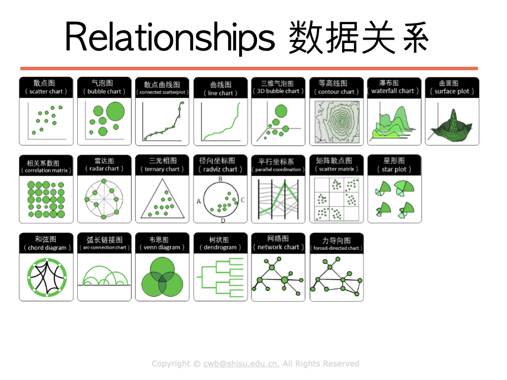

```{r setup, include=FALSE}
library(knitr)
knitr::opts_chunk$set(cache = TRUE, cache.lazy = FALSE, warning = FALSE,
                      message = FALSE, echo = TRUE, dpi = 180,
                      fig.width = 8, fig.height = 5)
library(tidyverse)
theme_set(theme_minimal())
update_geom_defaults("rect",list(fill = "midnightblue", alpha = 0.8))

library(tidyverse)
library(RColorBrewer)
```

# Relationships in R

We employ different plots to demostrate and explore the relationships.



# Two variables

- scatter plot

```{r}
data(airquality)
str(airquality)
```

plot the relationship between `Wind` and `Temperature`.

```{r}
airquality %>%               # the data
  ggplot(aes(Wind, Temp)) +  # aes layer
  geom_point()               # the Geom_layer
```

- Your TRUN:

Try to plot the relationship between `Solar.R` and `Temp`


- line graph

```{r}
airquality %>% 
  ggplot(aes(Wind, Temp)) +
  geom_line()
```

- In addition, we can always mapping other variables, with 
  + color
  + size
  + fill
  + alpha which then demostrate the relaitonships among more than 2 variables.
  
- using pkg`GGally` to viz multiple pairs of the correlations.

```{r}
library(GGally)

ggpairs(airquality)

# just for demonstration, you can do some variable selection before run ggpairs.

```


# More than two variables

Use bubble plot, to mapping the third quantitative variable in the size of the area.

- bubble plot

```{r}
airquality %>% 
  ggplot(aes(Wind, Temp, size = Solar.R)) + 
  geom_point()
```

Your can polishing the plot by customize the `shape`,`color`,`fill`, etc.

